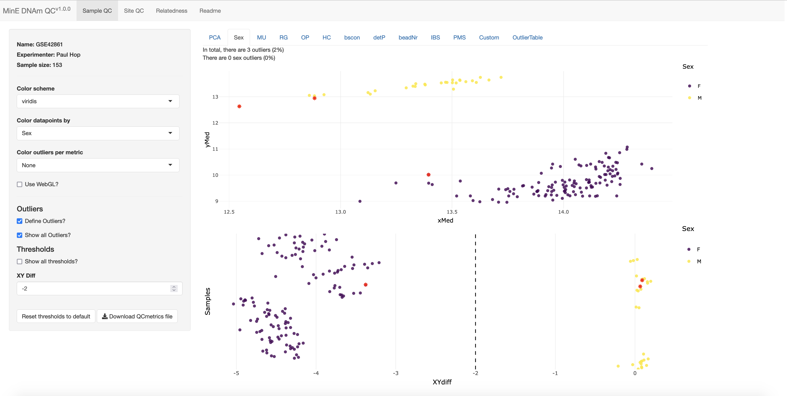
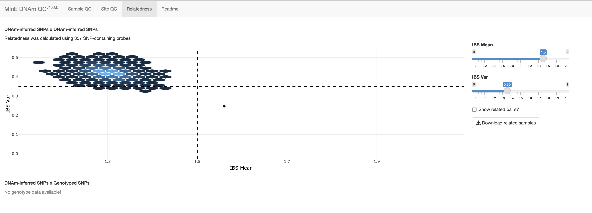

```{r, include = FALSE}
knitr::opts_chunk$set(
  collapse = TRUE,
  comment = "#>",
  warning = FALSE,
  cache = TRUE
)
```

# Introduction

This tutorial illustrates how this package can be used in conjunction with several other R packages to form a complete EWAS workflow.
Note that for several steps (i.e. normalization and EWAS confounder adjustment) many methods exist, although it's outside the scope of this tutorial to provide a comprehensive overview of all these methods, we mention some alternatives at the end of this tutorial.

# Data

For this tutorial we'll use a subset of the rheumatoid arthritis dataset described in `vignette("GetExampleData")` [@liu_epigenome-wide_2013].

```{r, message = FALSE, warning = FALSE}
library(QCpG)
library(dplyr)
library(wateRmelon)
outdir <- "../GSE42861"
```

All results and intermediate files will be save in the 'workflow' folder within the output directory (`outdir`) specified above.

```{r}
dir.create(paste0(outdir, "/workflow"))
dir.create(paste0(outdir, "/workflow/logs"))
```

# Create and inspect QCmetrics

## Generate QCmetrics

We start by generating a QCmetrics file, we'll briefly describe the parameters we've specified:

-   `logfile`: file where log info will be written

-   `chunk_size`: maximum number of samples that will loaded at a time, a larger `chunk_size` will speed up the analysis, but will use more RAM.

-   `experimenter`/`name`: This will be stored in the metadata of the `QCmetrics()` object.

-   `snplinker`: Which probes to use to estimate genetic relationships (i.e. which probes reflect underling SNPs).
    Here we use the `snplinker_mine` dataset which is included in the R package, this dataset includes probes that were shown to accurately measure underlying SNPs in the Project MinE data.

-   `heatmap_variables`/`heatmap_variables_fct`: For which variables should the association with principal components be calculated (which are displayed in a heatmap in the `QCapp()` (`heatmap_variables_fct` indicates which variables should be treated as factors.

-   `calculate_PCs` / `n_probes_PCA`: Specified that PCA should be performed using the 20,000 most variable probes.

-   `path_failed_measurements`: Indicates that a sparse matrix should be saved that indicates for each measurement whether it is of low quality.
    In [Mask low-quality measurements](#mask) we show how to use this matrix to mask low-quality measurements.

```{r}
samplesheet <- readRDS(sprintf("%s/samplesheet_GSE42861.rds", outdir))

# Generate QC metrics object
qcmetrics <- getQCmetrics( 
  samplesheet = samplesheet,
  logfile = paste0(outdir, "/workflow/logs/qcmetrics.log"),
  chunk_size = 40,
  experimenter = "Paul Hop",
  name = "GSE42861",
  snplinker = QCpG::snplinker_mine,
  heatmap_variables = c("disease_state", "Age", "Smoking_Status", "Slide"),
  heatmap_variables_fct = c("disease_state", "Smoking_Status", "Slide"),
  calculate_PCs = TRUE,
  n_probes_PCA = 20000,
  path_failed_measurements = paste0(outdir, "/workflow/failed_measurements.rds")
)

# Save 
saveRDS(qcmetrics, paste0(outdir, "/workflow/qcmetrics.rds"))
```

## Inspect QCmetrics

```{r, eval = FALSE}
QCapp(qcmetrics)
```

Some examples:







## Save publication-quality figures

Although we recommend interactively exploring the `QCmetrics` in the `QCapp()` you may want to save the visualizations shown within the `QCapp()` to your computer for publication purposes for example.
Therefore, we included a \`savePlots()\` method, that saves all plots to a specified directory and allows control over quality, size, filetype etc.

```{r}
savePlots(qcmetrics,
          outdir = sprintf("%s/workflow/figures", outdir),
          name = "ewas_GSE42861")
```

# Clean & Normalize {#cleannormalize}

After inspecting the `QCmetrics`, we'll continue with removing sample and probes that failed QC and additionally we'll exclude related samples.

## Specify samples and probes to exclude

We can use the getters (`getSampleOutliers()`, `getProbeOutliers()` and `getRelatedPairs()`) to extract samples and probes to exclude:

```{r}
sample_outliers <- getSampleOutliers(qcmetrics)
probe_outliers <- getProbeOutliers(qcmetrics)
related_samples <- getRelatedPairs(qcmetrics)
```

## Normalize

For normalization we'll use the `dasen()` function from the [wateRmelon](https://www.bioconductor.org/packages/release/bioc/html/wateRmelon.html) R package [@pidsley_data-driven_2013].
We recommend the [bigmelon](https://www.bioconductor.org/packages/release/bioc/html/wateRmelon.html) package for a more memory-efficient implementation of these functions.

```{r, include=FALSE}
library(methylumi)
library(wateRmelon)
```

```{r, eval=FALSE}
# Create Mset
mset <- readEPIC(paste0(outdir, "/IDATs"))

# Remove sample outliers from Mset
mset <- mset[,!colnames(mset) %in% c(sample_outliers$Sample_Name, related_samples$Sample_Name.x)]

# save
saveRDS(mset, file = paste0(outdir, "/workflow/mset_cleaned.rds"))

# Normalize using dasen
mset <- dasen(mset)

# Get betas 
beta <- betas(mset)

# Remove failed probes and remove SNP-probes
beta <- beta[!rownames(beta) %in% probe_outliers$Probe & !grepl("rs", rownames(beta)), ]
dim(beta)

# Save rds-file
saveRDS(beta, paste0(outdir, "/workflow/beta_cleaned_normalized.rds"))

# also save as txt-file
probes <- rownames(beta)
beta <- cbind(Probe = probes, as.data.frame(beta))
readr::write_tsv(beta, path = paste0(outdir, "/workflow/beta_cleaned_normalized.txt"))
```

## Update QCmetrics

After normalization, the `QCmetrics` object can be updated using the `updateQCmetrics()` where the principal components and polymethylation scores are recalculated based on the normalized betas:

```{r}
qcmetrics_cleaned <- updateQCmetrics(
  qcmetrics = qcmetrics,
  samplesheet = qcmetrics@samplesheet,
  beta = paste0(outdir, "/workflow/beta_cleaned_normalized.txt"),
  beta_format = "txt",
  chunk_size = 40,
  calculate_PCs = TRUE,
  n_probes_PCA = 20000,
  heatmap_variables = c("disease_state", "Age", "Smoking_Status", "Slide"),
  heatmap_variables_fct = c("disease_state", "Smoking_Status", "Slide")
)

saveRDS(qcmetrics_cleaned, paste0(outdir, "/workflow/qcmetrics_cleaned.rds"))
```

# Mask low-quality measurements {#mask}

In [Create and inspect QCmetrics] we have saved a matrix that indicates for each measurement whether it has failed QC.
We can use this matrix in the `mask_measurements()` function to set these low quality measures to missing:

```{r, message = FALSE, results='hide'}
mask <- readRDS(paste0(outdir, "/workflow/failed_measurements.rds"))


mask_measurements(
  beta = paste0(outdir, "/workflow/beta_cleaned_normalized.txt"),
  mask_matrix = mask,
  output = paste0(outdir,"/workflow/beta_cleaned_normalized_masked.txt")
)
```

# Perform an EWAS

In this section we'll perform an EWAS on smoking status (currents vs. never/past smokers).
We use [limma](https://bioconductor.org/packages/release/bioc/html/limma.html) [@ritchie_limma_2015] to perform the association tests (linear models).

We'll control for both known confounders, as well as several DNAm-derived variables included in the `QCmetrics()` object:

-   Array-wide PCs (`getPCs()`)

-   Control probe PCs (`getControlPCs()`)

-   DNAm-based predictors (poly-methylation scores) of Alcohol use and BMI.
    (`getPMS()`)

After performing these linear models, we used [bacon](https://bioconductor.org/packages/release/bioc/html/bacon.html) to control for residual bias/inflation in test-statistics [@van_iterson_controlling_2017].
In the [EWAS] section we discuss a few alternative methods.

## Prepare data

Prepare an annotation file and add PCs, control PCs and PMSs included in `QCmetrics()` to the samplesheet:

```{r}
library(IlluminaHumanMethylation450kanno.ilmn12.hg19) # annotation file

qcmetrics_cleaned <- readRDS(paste0(outdir, "/workflow/qcmetrics_cleaned.rds"))

## Annotation file 
anno_450k <- as.data.frame(getAnnotation(IlluminaHumanMethylation450kanno.ilmn12.hg19))
anno_450k_autosomal <- anno_450k %>%
  dplyr::filter(!chr %in% c("chrX", "chrY"))

## Add PCs and polymethylation scores to samplesheet 
samplesheet=qcmetrics_cleaned@samplesheet
samplesheet <- samplesheet %>%
  dplyr::left_join(
    getPMS(qcmetrics_cleaned), by="Sample_Name"
  ) %>% 
  dplyr::left_join(
    getPCs(qcmetrics_cleaned), by="Sample_Name"
  ) %>%
  dplyr::left_join(
    getControlPCs(qcmetrics_cleaned), by="Sample_Name"
  )

## Format Smoking status as 1 (current smoker) and 0 (never or ex-smoker)
samplesheet <- samplesheet %>% dplyr::mutate(Smoking = dplyr::case_when(
  Smoking_Status %in% c("current") ~ 1L,
  Smoking_Status %in% c("never", "ex") ~ 0L,
  TRUE ~ NA_integer_
))

```

## Limma + bacon

Here we perform the linear models (adjusted for potential confounders) followed by bacon.
Note that we perform limma at the entire beta-matrix at once.
Alternatively, the linear models could be performed at chunks of the beta-matrix at a time to reduce RAM usage.

```{r, message = FALSE}
## Libraries
library(limma)
library(bacon)

## Remove samples for which smoking outcome is unavailable:
samplesheet <- samplesheet %>% dplyr::filter(!is.na(Smoking))

## Specify design matrix
pheno <- "Smoking"
covariates <- c("disease_state", "Age", "Sex", "Alcohol_PMS", "BMI_PMS", "NK", "CD4T", "CD8T", "Mono", "Neutro",
                "PC1", "PC2", "PC3", "PC4", "PC5", "PC1_control", "PC2_control", "PC3_control", "PC4_control", "PC5_control")

formula <- sprintf("~%s + %s", pheno, paste(c(covariates), collapse = " + "))
design <- model.matrix(as.formula(formula), data = samplesheet)

## Load normalized and masked beta-matrix:
beta <- readr::read_tsv(paste0(outdir,"/workflow/beta_cleaned_normalized_masked.txt"))
probes <- beta$Probe
beta <- as.matrix(beta[,2:ncol(beta)])
rownames(beta) <- probes
beta <- beta[rownames(beta) %in% anno_450k_autosomal$Name,samplesheet$Sample_Name]

## Peform EWAS
fit <- limma::lmFit(beta, design)

## Extract p-values
ordinary.t <- fit$coef / fit$stdev.unscaled / fit$sigma
pval <- 2*pt(-abs(ordinary.t), fit$df.residual)
pval <- pval[,2]

stats <- tibble(Probe = names(pval),
                b = fit$coefficients[,2][as.character(names(pval))],
                t = ordinary.t[,2],
                se = b / t,
                p = pval, 
                logp = -log10(pval),
                df = fit$df)

## Perform bacon
bacon <- function(stats) {
  bc <- bacon::bacon(effectsizes = cbind(stats$b), standarderrors = cbind(stats$se))
  stats$b <- round(drop(bacon::es(bc)), digits = 6)
  stats$se <- round(drop(bacon::se(bc)), digits = 6)
  stats$t <- drop(bacon::tstat(bc))
  stats$p <- 2*pt(abs(stats$t), df = stats$df, lower.tail = FALSE)
  stats
}
stats <- bacon(stats)

## Significant sites
threshold <- 2.4 * 10^-7 # see (Mansell et al. 2019)

stats_sig <- stats %>%
  dplyr::filter(p < threshold)

## Add annotation
stats <- stats %>%
  dplyr::left_join(anno_450k[,c("Name", "chr", "pos", "UCSC_RefGene_Name", "UCSC_RefGene_Group")], by=c("Probe"="Name")) %>%
  dplyr::rename(bp=pos)

library(FDb.InfiniumMethylation.hg19)
anno <- get450k()
nearest_gene <- getNearestGene(anno[stats_sig$Probe])
nearest_gene <- data.frame(Probe = rownames(nearest_gene), gene=nearest_gene$nearestGeneSymbol)
stats <- stats %>% dplyr::left_join(nearest_gene, by=c("Probe"))

```

## Exclude potential spurious probes

Several probes should generally be excluded because they are unreliable, including probes that map to multiple locations in the genome (cross-hybridizing probes) and probes that overlap with genetic variation [@zhou_comprehensive_2017].

### Cross-hybridization

We have previously described several cross-hybridization issues [@hop_cross-reactive_2020], which is accompanied by an R package ([DNAmCrosshyb](https://github.com/pjhop/DNAmCrosshyb)) to map probes to either the entire genome or to specific DNA sequences.
Below we will do the former, testing whether the 30bp 3'-subsequence matches multiple locations in the genome.

```{r}
## Mask probes 
library(DNAmCrosshyb)
genome_bs <- paste0(outdir, "/workflow/genome_bs/hg19")

matches <- map_probes(stats_sig$Probe,
                      path = genome_bs,
                      chromosomes = "all",
                      min_width = 30,
                      max_width = 30,
                      step_size = 5,
                      allow_mismatch = TRUE,
                      allow_INDEL = FALSE,
                      cores = 1
                     )

# Check which matches do not match with the intended position
matches_mismatch <- matches %>%
  dplyr::left_join(DNAmCrosshyb:::anno450k %>% dplyr::mutate(probeType = ifelse(stringr::str_detect(Name,"ch"), "ch", "cg")) %>% dplyr::select(c("Name", "chr", "pos", "probeType")) %>% dplyr::rename(chr_annotated = chr, c_pos_annotated = pos),
                   by = c("Probe" = "Name")) %>%
  dplyr::mutate(
    c_pos = dplyr::case_when(
      strand == "forward" & Type2 == "II" & probeType == "cg" ~ start - 1,
      strand == "reverse" & Type2 == "II" & probeType == "cg"  ~ end,
      strand == "forward" & probeType == "cg" ~ start,
      strand == "reverse" & probeType == "cg"  ~ end - 1,
      probeType == "ch" & strand == "forward" ~ start - 1,
      probeType == "ch" & strand == "reverse" ~ end + 1
    )
  ) %>%
  dplyr::mutate(chr_annotated = stringr::str_replace(chr_annotated, "chr", ""))

matches_mismatch <- matches_mismatch %>%
  dplyr::filter(!(chr == chr_annotated & c_pos == c_pos_annotated)) %>%
  dplyr::count(Probe)
```

### Probes overlapping with genetic variation

Often, probes that overlap with genetic variants are excluded, here we use the annotation from Zhou *et al.* [@zhou_comprehensive_2017] where the `MASK_general` column excluded (among others) probes that have a SNP within 5bp of the '3 end of the probe (with a global MAF \> 0.01).

```{r, message = FALSE}
## Snp probes
# Middle Sweden.
mask <- readr::read_tsv("https://zhouserver.research.chop.edu/InfiniumAnnotation/20180909/HM450/HM450.hg38.manifest.tsv.gz")
mask <- mask %>% 
  dplyr::filter(MASK_general)
```

### Filter and save results

```{r}
# filter
stats <- stats %>% dplyr::filter(!Probe %in% mask, !Probe %in% matches_mismatch$Probe) %>%
  dplyr::arrange(p)

# save
readr::write_tsv(stats,
                 file = gzfile(paste0(outdir,"/workflow/ewas_stats_limma_bacon_filtered.txt.gz")))
                 
```

## Visualize results

For visualization we'll use a couple of functions (manhattan, qq-plot) that we used in an earlier project

```{r, message = FALSE}
source("https://raw.githubusercontent.com/pjhop/dnamarray_crossreactivity/master/R/ewas_plot_functions.R")
```

```{r}
gg_qqplot(stats$p, text_size = 13, point_size = 2)
```

Several well-known smoking hits are identified, such as those in *AHRR*, *ALPG* (*ALPPL2*) and *GFI1*:

```{r}
gg.manhattan(stats, annotate = TRUE, threshold = threshold)
```

```{r}
save.image("../GSE42861/workspace_19092021.rda")
```

### Overlap with previous smoking EWASs

In order to check if the identified hits are concordant with published EWASs on smoking, we can download EWAS test statistics from EWASdb [@liu_ewasdb_2019].
We prefiltered the results in EWASdb on smoking EWASs in blood.
Apparently all hits we identify here have previously been found to be associated with smoking!

```{r, message=FALSE}
EWASdb_smoking <- readr::read_tsv(paste0(outdir, "/workflow/EWASdb_smoking.tsv.gz"))
stats_sig <- stats %>%
  dplyr::filter(p < 2.4 *10^-7)

mean(stats_sig$Probe %in% EWASdb_smoking$`Probe id`)
```

# A few alternatives

Some alternatives for performing normalization and correction for confounding in EWAS (note that this list is by no means exhaustive).i

## Normalization

### Functional normalization

Apply functional normalization [@fortin_functional_2014], as implemented in [minfi](https://bioconductor.org/packages/release/bioc/html/minfi.html) [@aryee_minfi_2014]:

```{r}
library(minfi)

# Create an RGset
rgset <- read.metharray(samplesheet$Basename, extended=TRUE)

# Remove sample outliers from RGset
rgset <- rgset[,!colnames(rgset) %in% sample_outliers$Sample_Name]

# Normalize using functional normalization
rgset_normalized <- preprocessFunnorm(rgset, nPCs = 3)

# get Beta values 
beta <- getBeta(rgset_normalized)

# Remove failed probes 
beta <- beta[!rownames(beta) %in% probe_outliers$Probe, ]

beta[1:5, 1:3]
```

### bigmelon

The [bigmelon](https://bioconductor.org/packages/release/bioc/html/bigmelon.html) package extends the capabilities of [wateRmelon](%5B%3Chttps://www.bioconductor.org/packages/release/bioc/html/wateRmelon.html%3E) to work with large data [@gorrie-stone_bigmelon_2019].

```{r, message = FALSE, eval = FALSE}
# Convert mset to gds-file
library(methylumi)
library(wateRmelon)
library(bigmelon)

# note for convenience (since we already made an mset) we'll convert
# the mset to a gds-file. Note that it's also possible within bigmelon
# to make a gds-file directly from IDATs, in which case you don't have to 
# load the entire mset into memory.

mset <- readRDS(paste0(outdir, "/workflow/mset_cleaned.rds"))
gfile <- es2gds(mset, paste0(outdir, "/workflow/mset_cleaned_gds.gds"))
```

Normalize using dasen:

```{r, eval = FALSE}
dasen(gfile, node = "dasen") # note that this is written to disk
```

```{r}
library(methylumi)
library(wateRmelon)
library(bigmelon)

gfile <- openfn.gds(paste0(outdir, "/workflow/mset_cleaned_gds.gds"))
betas(gfile)[1:5,1:5]
gfile[,, node = "dasen"][1:5,1:5]
closefn.gds(gfile)
```

## EWAS

### OSCA

OSCA ([link](https://cnsgenomics.com/software/osca/#Overview)) is a recent method in which the random effect of total genome-wide DNA methylation captures the correlation structure between probes and directly controls for the genomic inflation [@zhang_osca_2019].
OSCA is written in C/C++, and is available as a command-line executable, thus after preparing the data in the right format, we'll run OSCA from the command-line.

### Save data in OSCA format

```{r}
##  Add 'IID' and 'FID' columns to beta-file 
samples <- colnames(beta)
beta <- t(beta)
beta <- dplyr::as_tibble(beta)

beta <- dplyr::bind_cols(data.frame(samples), data.frame(samples), beta)
colnames(beta)[1] <- 'IID'
colnames(beta)[2] <- 'FID'

# Write to txt-file
# readr::write_tsv(beta, 
#                  path = paste0(outdir, "/workflow/osca/beta_cleaned_normalized_osca.txt"), 
#                  col_names = TRUE)

# faster alternative
data.table::fwrite(beta, file = paste0(outdir, "/workflow/beta_cleaned_normalized_osca.txt"), sep = "\t", na = "NA", quote = FALSE)
```

Save covariates and phenotype:

```{r}
# Covariates ---------------------------------------------------------------
qcovariates <- c("Age", "Alcohol_PMS", "BMI_PMS", "NK", "CD4T", "CD8T", "Mono", "Neutro")
covariates <- c("disease_state", "Sex")
phenotype <- c("Smoking")
levels <- c("0", "1")

# Select covariates/phenotype
samplesheet <- samplesheet[complete.cases(samplesheet[,c(covariates, qcovariates, phenotype)]),]
samplesheet <- samplesheet %>%
  dplyr::filter((!!as.name(phenotype) %in% levels))

covar <- apply(samplesheet[,covariates,drop=FALSE], 2, FUN = function(x) as.numeric(as.factor(x)))
covar <- data.frame(IID = samplesheet$Sample_Name, FID = samplesheet$Sample_Name, covar)

qcovar <- data.frame(IID = samplesheet$Sample_Name, FID = samplesheet$Sample_Name, samplesheet[,qcovariates])

phenotype <- data.frame(IID = samplesheet$Sample_Name, FID = samplesheet$Sample_Name,
                        ifelse(samplesheet[[phenotype]] == levels[2], 1, 0))

keep <- data.frame(IID = samplesheet$Sample_Name, FID = samplesheet$Sample_Name)

## Save
readr::write_tsv(qcovar, path = sprintf("%s/workflow/osca/qcovar.txt", outdir), col_names=FALSE)
readr::write_tsv(covar, path = sprintf("%s/workflow/osca/covar.txt", outdir), col_names=FALSE)
readr::write_tsv(keep, path = sprintf("%s/workflow/osca/keep.txt", outdir), col_names=FALSE)
readr::write_tsv(phenotype, path = sprintf("%s/workflow/osca/pheno.txt", outdir), col_names=FALSE)
```

### Run OSCA in the command-line

Convert txt-file to OSCA's format (in command-line):

```{bash, eval = FALSE}
outdir="../GSE42861"
oscapath="~/osca_Linux"
mkdir $outdir/workflow/osca
~/osca_Linux --efile ${outdir}/workflow/osca/beta_cleaned_normalized_osca.txt \
--methylation-beta \
--make-bod \
--out ${outdir}/workflow/osca/beta_cleaned_normalized_osca > ${outdir}/workflow/osca/beta_cleaned_normalized_osca.log

```

Run OSCA MOA:

```{bash, eval=FALSE}
outdir="../GSE42861"

~/osca_Linux --befile ${outdir}/workflow/beta_cleaned_normalized_osca \
--pheno ${outdir}/workflow/osca/pheno.txt \
--covar ${outdir}/workflow/osca/covar.txt \
--qcovar ${outdir}/workflow/osca/qcovar.txt \
--moa \
--out ${outdir}/workflow/osca/ewas_moa

```

### Visualize

```{r, message = FALSE}
ewas_moa <- readr::read_tsv(sprintf("%s/workflow/osca/ewas_moa.moa", outdir))
ewas_moa <- ewas_moa %>% dplyr::filter(!Probe %in% mask, !Probe %in% matches_mismatch$Probe) %>%
  dplyr::arrange(p)

ewas_moa <- ewas_moa %>%
  dplyr::select(-c("Chr", "bp", "Gene", "Orientation")) %>%
  dplyr::left_join(anno_450k[,c("Name", "chr", "pos", "UCSC_RefGene_Name", "UCSC_RefGene_Group")], by=c("Probe"="Name")) %>%
  dplyr::rename(bp=pos)

ewas_moa <- ewas_moa %>% dplyr::left_join(nearest_gene, by=c("Probe"))
```

Note that the inflation if a bit lower than in the limma+bacon results ([Visualize results]):

```{r}
gg_qqplot(ewas_moa$p, text_size = 13, point_size = 2)
```

```{r}
gg.manhattan(ewas_moa, annotate = TRUE, threshold = threshold)
```

compare with limma+bacon results

```{r}
stats %>%
  dplyr::left_join(ewas_moa, by="Probe") %>%
  ggplot(aes(x = -log10(p.x), y = -log10(p.y))) +
    geom_abline(slope = 1, linetype = "dashed") +
    geom_point(size = 2, alpha = 0.6) +
    theme_classic() +
    coord_fixed() +
    xlab("-log10(P) LB") +
    ylab("-log10(P) OSCA MOA")

```

# References
