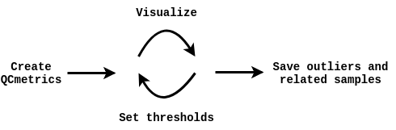
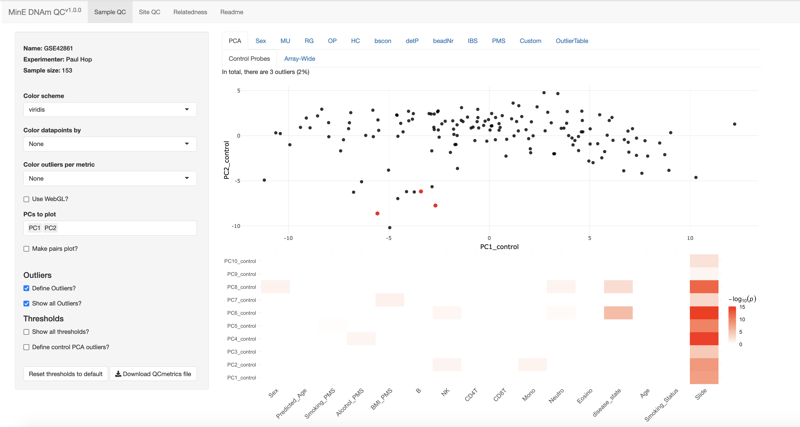

Here, we show the basic usage of the package. The main workflow of the package can be summarized as follows:



This package consists two main functions (corresponding to the first two steps of the workflow): `getQCmetrics()` and `QCapp()`:

-   `getQCmetrics()` : Create a `QCmetrics` object that contains summarized QC metrics, sample and probe outliers, relatedness info and several predicted traits/phenotypes (termed poly-methylation scores (PMS) here). The only input needed is a samplesheet containing the paths of the IDAT-files. Many more optional parameters can be specified (see `vignette("AdvancedOptions")`), for example: a genotype matrix can be supplied to assess DNAm-genotype concordance. This function will return an object of the `QCmetrics` class, which can be explored interactively using the `QCapp()` method.

-   `QCapp()` : Visualize a `QCmetrics` object (obtained with the `getQCmetrics()` function). This function launches a app in which the user can interactively explore the quality control metrics, set thresholds and define sample/probe outliers to be removed in subsequent analyses. In addition, relatedness among samples can be explored and several phenotypes/traits are included (age, sex, cell type fractions, smoking status, alcohol, and BMI). For comparison, other `QCmetrics` objects can be visualized in the background. When appropriate thresholds have been chosen, an updated QCmetrics object can be saved that contains the updated thresholds and outliers.

We intend to share the Project MinE `QCmetrics` objects (±10,000 samples), that can be used as a reference. Below we put the above in practice using example data.

# Load and process example data

First, we'll process the example data in the [minfiData](https://bioconductor.org/packages/release/data/experiment/html/minfiData.html) package. Note that this is a very small dataset for example purposes, in the `vignette("EWASworkflow")` vignette we showcase usage with a larger dataset.

```{r, message = FALSE}
# Libraries
library(dplyr)
library(minfiData)
library(QCpG)
```

Note that sex information should be coded as 'M'/'F' (NA if missing):

```{r, message = FALSE}
# Processing the data
baseDir <- system.file("extdata", package="minfiData")
samplesheet <- read.metharray.sheet(baseDir)

# The `getQCmetrics()` functions expects sex information to be coded as "M" and "F" (NA if missing) in a column named 'Sex" 
samplesheet <- samplesheet %>%
                    dplyr::mutate(Sample_Name =  paste(samplesheet$Slide,
                                  samplesheet$Array, sep = "_")) %>%
                    dplyr::rename(Sex = sex)

```

# Create QCmetrics object

The first step is to create a QCmetrics object using the `getQCmetrics()` function. The main argument of this function is a samplesheet which should contain the following columns:

-   `Sample_Name` : Unique sample identifier. Should be: Array_Position.
-   `Basename` : Paths to IDAT files
-   `Sex` : Sex of the samples, coded as 'M'/'F', or NA if missing.

Create the QCmetrics object: (note that the function has many more optional arguments, e.g. to include a genotype matrix to assess DNAm-genotype concordance, see `vignette("AdvancedOptions")`).

```{r, message = FALSE}
## Run getQCmetrics function with default parameters 
qcmetrics <- getQCmetrics(samplesheet)
qcmetrics
```

This results in an object of class `QCmetrics` and several common functions can be used to inspect it:

```{r, message = FALSE}
dim(qcmetrics) # Dimensions
nrow(qcmetrics) # Number of probes
ncol(qcmetrics) # Number of samples
colnames(qcmetrics) # Sample names
head(rownames(qcmetrics)) # Probe names
```

Show metadata:

```{r, message = FALSE}
metadata(qcmetrics)
```

Note that the 'Experiment_Name' and 'Experimenter' fields are empty, these can be set when creating the QCmetrics object:

```{r, message = FALSE}
## Run getQCmetrics function with default parameters 
qcmetrics <- getQCmetrics(samplesheet, 
                           name = "minfiData",
                           experimenter = "Paul Hop")
                           
metadata(qcmetrics)
```

Note that principal components (PCs) are not calculated by default, since this may significantly increase the RAM usage. By setting `calculate_PCs = TRUE` PCs will be calculated, RAM size can be reduced by limiting PCA to the most variable probes:

```{r, message = FALSE}
## Run getQCmetrics function with default parameters 
qcmetrics <- getQCmetrics(samplesheet, 
                           name = "minfiData",
                           calculate_PCs = TRUE,
                           n_probes_PCA = 20000,
                           experimenter = "Paul Hop")
                           
```

# Visualize

Now that we've created a QCmetrics object, the next step is to visualize it by launching the QCapp:

```{r, message = FALSE, eval = FALSE}
## Launch app (only works in interactive session)
QCapp(qcmetrics)
```

This will launch the QCapp in your default browser (Chrome is recommended), which will look something like this (note this is a screenshot from the example data shown in `vignette("EWASworkflow"):`



Within the app users can visualize both samples and probes across several QC metrics, inspect relatedness among the samples and inspect predicted phenotypes (PMS). This package contains a set of default thresholds based on a combination of defaults used in underlying packages (*MethylAid*, *wateRmelon, minfi*) and defaults based on our experience with Project MinE data. More details on the QC metrics used and usage of the QC app are provided in section 5. When appropriate thresholds have been chosen, an updated QCmetrics object can be saved that contains the updated thresholds and outliers.

Another `QCmetrics` object can be supplied to the `background` parameter, which will then be plotted as background in the relevant plots.

```{r, message = FALSE, eval = FALSE}
## Launch app (only works in interactive session)
QCapp(qcmetrics, background = qcmetrics2)
```

# Extract sample/probe outliers, related samples and PMSs

The main methods to extract samples/probes are:

-   `getSampleOutliers()` : Extracts samples that fail QC based on thresholds saved within the QCobjects object\*

-   `getProbeOutliers()` : Extracts probes that fail QC based on thresholds saved within the QCobjects object\*

-   `getRelatedPairs()` : Extracts pairs of samples that appear to be related based on thresholds saved within the QCobjects object\*

-   `getPMS()` : Returns predicted phenotypes for all samples. Phenotypes currently included are: age (three predictors), sex, smoking score, BMI, alcohol, and cell-type fractions.

\*these thresholds can be modified within the QC app

Extract sample outliers:

```{r, message = FALSE}
getSampleOutliers(qcmetrics)
```

Show an overview of outliers:

```{r, message = FALSE, warning = FALSE}
getOutlierOverview(qcmetrics)
```

Extract probe outliers:

```{r, message = FALSE}
getProbeOutliers(qcmetrics)
```

Extract related pairs of individuals:

```{r, message = FALSE}
getRelatedPairs(qcmetrics)
```

Extract predicted phenotypes:

```{r, message = FALSE}
getPMS(qcmetrics)
```

# Save publication-quality plots

Although we recommend interactively exploring the `QCmetrics` in the `QCapp()`, you may want to save high-quality figures for publication purposes for example. Although it is possible to save plots within the `QCapp()` by clicking 'Download plot as png' in the toolbar shown in the right upper corner of plots, this doesn't provide much control for example the size and quality of the figure and is tedious to do for each figure individually. Therefore, we included a `savePlots()` method, that saves all plots to a specified directory and allows control over quality, size, filetype etc.

Example:

```{r, eval = FALSE}
savePlots(qcmetrics,
          outdir = "~/test_dir",
          name = "minfidata")
```

Fine-tune figure properties and color by Sex:

```{r, eval = FALSE}
savePlots(qcmetrics,
          outdir = "~/test_dir",
          name = "minfidata", 
          colorby = "Sex",
          filetype = "pdf",
          point_size = 2,
          width = 6,
          height = 4)
```

# Update QCmetrics file

After samples and probes have been excluded and data is normalized, you may want to update the QCmetrics file with PCs/PMSs based on the cleaned/normalized data.

The `updateQCmetrics()` method does just that, below an example where samples/probes are excluded based on the `QCmetrics` file, normalized using `minfi::preprocessFunnorm()` (see `vignette("EWASworkflow")` )

```{r, message = FALSE}
## Example cleaned/normalized qcmetrics file
qcmetrics <- getQCmetrics(samplesheet)
rgset <- read.metharray(samplesheet$Basename, extended=TRUE)

# Normalize using functional normalization
rgset_normalized <- preprocessFunnorm(rgset[,!colnames(rgset) %in% getSampleOutliers(qcmetrics)$Sample_Name], nPCs = 3)

# get beta-values 
beta_normalized <- getBeta(rgset_normalized)

# Remove failed probes 
beta_normalized <- beta_normalized[!rownames(beta_normalized) %in% getProbeOutliers(qcmetrics)$Probe, ]

# Update qcmetrics based on normalized betas
qcmetrics_updated <- updateQCmetrics(qcmetrics = qcmetrics,
                                     samplesheet = samplesheet,
                                     beta = beta_normalized,
                                     calculate_PCs = TRUE)
qcmetrics_updated
```

Note that the `updateQCmetrics()` method can also read in the betas in chunks from a txt-file to reduce RAM usage:

```{r, eval = FALSE}
# For this example, save the normalized betas to a txt-file
readr::write_tsv(as.data.frame(cbind(Probe = rownames(beta_normalized), beta_normalized)),"../tmp/beta_normalized.txt")
```

```{r, message = FALSE}
qcmetrics_updated <- updateQCmetrics(qcmetrics = qcmetrics,
                                     samplesheet = samplesheet,
                                     beta = "../tmp/beta_normalized.txt",
                                     read_chunks = TRUE,
                                     chunk_size = 2,
                                     calculate_PCs = TRUE)
dim(qcmetrics_updated)
```

# References
