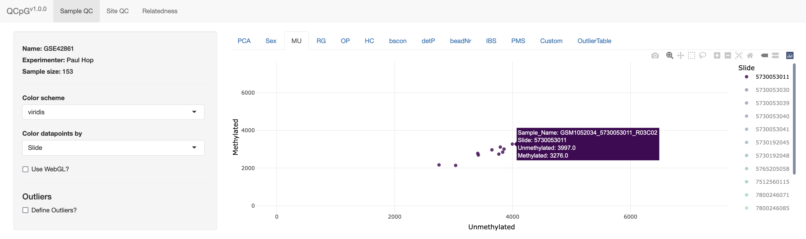

Step-by-step walkthroughi of the QCapp

# Start screen

1.  Top-level tabs, there is a seperate tab for Sample QC, Probe QC and relatedness.
2.  Name of the experiment and experimenter (if provided in the `getQCmetrics()` function) and the sample size.
3.  Datapoints can be colored by any column that is included in the samplesheet. Various color schemes can be used.
4.  Specific for PCA plots, choose which PCs to plot.

# Defining outliers

The sidebar gets extended when the 'Define Outliers?' option is selected.\
1. If this option is selected, outliers can be defined.

2.  Show all outliers (i.e. across all metrics), rather than only the outliers for the metric currently being plotted.

3.  By default, only the threshold for the currently plotted metric will be shown. By selecting this option all thresholds will be shown.

4.  Set threshold.

5.  

    -   'Reset thresholds in defaults': Reset all thresholds to the default.

    -   'Download QCmetrics file. Download an updated QCmetrics file with the chosen thresholds.

    

# Including custom outliers

Custom outliers can be included based on columns in the samplesheet. The column should be coded as TRUE/FALSE.

# Probe QC

The Probe QC tab looks and works similar to the sample QC tab. The left sidebarpanel can be used to define thresholds (if the 'Define Outliers' option is selected).

If the option 'Mask Crossreactive/SNP-probes' is selected, a population can be chosen that matches the study population. The 'MASK_general' columns filter based on the recommendations by Zhou *et al.* [@zhou_comprehensive_2016].

# Relatedness

The 'Relatedness' tabs shows the IBS mean and IBS var for all pairs of samples. Note that all unrelated samples are summarized in hexbins, only IBS of samples that are related (based on the set thresholds) are shown as individual dots. The IBS mean and IBS var threshold can be adjusted. The related samples can be downloaded as a separate file, but we recommend saving an updated QCmetrics-file (which can be done in the 'Sample QC' tab). Related samples can be extracted from the QCmetrics file using the `getRelatedPairs()` method.

# Interactive plotting

We use the *plotly* library to enable interactive plotting [@sievert_plotly_2018]. Some examples:

# Selecting samples

Several options are displayed in the right upper corner of the plot when hovering the mouse over the plot. The box and lasso-shaped tools can be used to select samples (either with a box or a lasso respectively). Additionally, samples can be selected by simply clicking on them.

After selecting sample, they're highlighted with blue diamonds. A panel appears with an option to download the selected samples. Click the 'reset selected samples' button to remove the selection.

# Choosing groups to plot

When datapoints are colored by a categorical variable, single-clicking one of the categories in the legend will remove that category from the plot. Double-clicking a category will only show samples in that category (as shown in the plot above).

Hovering the mouse over a sample shows information on the sample.

# References
